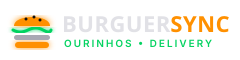

# 🍔 BurguerSync Ourinhos

<div align="center">



**Sistema Full-Stack de Pedidos & Painel de Cozinha em Tempo Real (KDS)**  
*Full-Stack Realtime Order & Kitchen Display System (KDS)*

[](https://antigravity.google/)
[](https://stitch.googleapis.com/)
[](https://firebase.google.com/)
[](https://tailwindcss.com/)
[](https://nodejs.org/)
[](https://sp.senai.br/)

</div>

---

## 🇧🇷 Português (Brasil)

### 📌 Sobre o Projeto
O **BurguerSync Ourinhos** é uma aplicação completa de delivery gastronômico e gestão de cozinha em tempo real (KDS - *Kitchen Display System*), criada para eliminar o atrito operacional de hamburguerias artesanais. O cliente monta seu pedido de forma fluida e intuitiva, e a cozinha recebe as comandas instantaneamente sem necessidade de recarregar a página (F5), acompanhando o status do preparo em tempo real.

O projeto foi inteiramente arquitetado e orquestrado no **Google Antigravity**, integrando componentes de design de alta fidelidade gerados no **Google Stitch** com a persistência reativa do **Firebase Cloud Firestore**.

### 🤖 Agentes de IA e Skill Packs Utilizados
* **Agente Principal:** `agente-orquestrador` (Camada 2 - Orquestração e Inteligência de Decisão)
* **Skill Packs:**
  * `@[app-builder]`: Engenharia de arquitetura e montagem da aplicação
  * `@[design-spec]`: Especificação de tokens e conformidade de interface com o Google Stitch
  * `@[clean-code]`: Padrões pragmáticos de código limpo e arquitetura resiliente
  * `@[frontend-design]`: Estética *Dark Neon Gastronomy* com *glassmorphism* e feedback sonoro

### 🏗️ Arquitetura de 3 Camadas (Antigravity v2.5.5)
1. **Camada 1 (Diretivas & Estratégia):** 
   - [`directives/projeto.md`](file:///c:/Users/Aluno/Documents/antigravity%20cleiton%20mariano/aula%207%20projeto%2001%20burguersync/directives/projeto.md): SOP Mestre com regras de negócio e dados.
   - [`design/design.md`](file:///c:/Users/Aluno/Documents/antigravity%20cleiton%20mariano/aula%207%20projeto%2001%20burguersync/design/design.md): Tokens visuais *Dark Neon Gastronomy* exportados do Google Stitch.
2. **Camada 2 (Orquestração & Decisão):**
   - Agente Antigravity integrando o protótipo do Stitch, Firebase Web SDK v10 e tratamento de auto-recuperação (*Self-Annealing*).
3. **Camada 3 (Execução & Determinismo):**
   - [`frontend/`](file:///c:/Users/Aluno/Documents/antigravity%20cleiton%20mariano/aula%207%20projeto%2001%20burguersync/frontend/): Código cliente HTML5, CSS3 e JavaScript ES6 via CDN.
   - [`backend/`](file:///c:/Users/Aluno/Documents/antigravity%20cleiton%20mariano/aula%207%20projeto%2001%20burguersync/backend/): Regras de segurança do Firestore e servidor HTTP determinístico.
   - [`execution/`](file:///c:/Users/Aluno/Documents/antigravity%20cleiton%20mariano/aula%207%20projeto%2001%20burguersync/execution/): Scripts de validação e publicação no GitHub via REST API.

### 🚀 Como Executar o Projeto

#### Forma 1: Duplo Clique (Windows)
Dê um duplo clique no arquivo [`executar.bat`](file:///c:/Users/Aluno/Documents/antigravity%20cleiton%20mariano/aula%207%20projeto%2001%20burguersync/executar.bat). Ele abrirá o navegador e o servidor local automaticamente.

#### Forma 2: Via Linha de Comando (Terminal)
```bash
# 1. Iniciar o servidor local (porta 3000)
node backend/server.js

# 2. Acesse no navegador:
http://localhost:3000
```

#### Scripts de Suporte da Camada 3:
```bash
# Testar conexão com o Firestore
node execution/verify_firebase.js

# Semear pedidos de demonstração na cozinha
node execution/seed_orders.js

# Publicar no GitHub via REST API
node execution/publish_github.js
```

---

## 🇺🇸 English

### 📌 About the Project
**BurguerSync Ourinhos** is a full-stack food ordering and realtime Kitchen Display System (KDS) engineered to eliminate operational friction in artisanal burger joints. Customers build their orders seamlessly, and the kitchen staff receives tickets instantly with zero page reloads (F5), tracking order transitions from grill to dispatch in real-time.

The application was designed, orchestrated, and verified using **Google Antigravity**, leveraging modern UI components from **Google Stitch** and reactive state persistence powered by **Firebase Cloud Firestore**.

### 🤖 AI Agents & Skill Packs Used
* **Master Agent:** `agente-orquestrador` (Layer 2 - Orchestration & Decision Intelligence)
* **Skill Packs:**
  * `@[app-builder]`: Full-stack application architecture and orchestration
  * `@[design-spec]`: Design token modeling and Google Stitch alignment
  * `@[clean-code]`: Pragmatic, self-documenting code standards
  * `@[frontend-design]`: *Dark Neon Gastronomy* aesthetic with glassmorphism and Web Audio chime alerts

### 🏗️ 3-Layer Architecture (Antigravity v2.5.5)
1. **Layer 1 (Directives & Strategy):** Business rules, SOPs (`directives/projeto.md`), and design tokens (`design/design.md`).
2. **Layer 2 (Orchestration & Decision):** Antigravity reasoning engine managing Stitch assets, Firebase real-time sync, and Self-Annealing error recovery.
3. **Layer 3 (Execution & Determinism):** Client codebase (`frontend/`), security rules (`backend/firestore.rules`), and automation scripts (`execution/`).

### 🚀 Getting Started
```bash
# Launch local server
node backend/server.js

# Open in browser:
http://localhost:3000
```

---

### 🏛️ Créditos e Agradecimentos
* **Desenvolvido com:** Google Antigravity
* **Estilização & Prototipação:** Google Stitch MCP
* **Persistência em Nuvem:** Firebase Cloud Firestore
* **Instituição:** SENAI Ourinhos - SP
