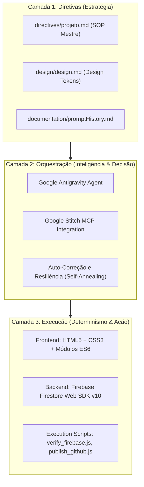
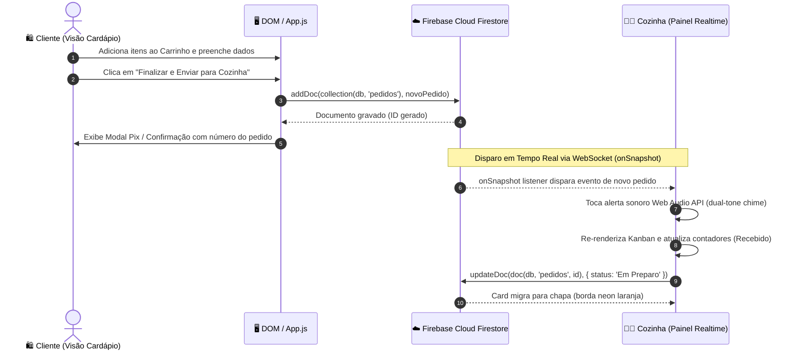

# 🏗️ Arquitetura do Sistema: BurguerSync Ourinhos

**Status:** Produção / Documentado | **Versão:** 2.5.5 | **Ambiente:** Google Antigravity & Firebase

---

## 1. Visão Geral da Arquitetura em 3 Camadas

O BurguerSync Ourinhos foi concebido sob a **Arquitetura de 3 Camadas** do framework Antigravity:



---

## 2. Fluxo de Dados em Tempo Real



---

## 3. Modelo de Dados no Firestore (`pedidos`)

```json
{
  "cliente": {
    "nome": "Mariana Costa",
    "email": "mariana.costa@email.com",
    "celular": "(14) 99123-4567",
    "endereco": "Jardim Matilde - Rua dos Ipês, 120",
    "obsEntrega": "Casa de esquina, portão branco"
  },
  "itens": [
    {
      "nome": "Monster Bacon SENAI",
      "preco": 34.00,
      "quantidade": 1,
      "obsItem": "Ponto da carne: Ao ponto para mal passado"
    },
    {
      "nome": "Batata Rústica Suprema",
      "preco": 18.00,
      "quantidade": 1,
      "obsItem": "Bastante alecrim"
    }
  ],
  "pagamento": {
    "metodo": "Pix",
    "troco": null
  },
  "valores": {
    "subtotal": 52.00,
    "taxaEntrega": 5.00,
    "total": 57.00
  },
  "status": "Recebido",
  "horario": "2026-09-26T15:10:00.000Z"
}
```

---

## 4. Integração Google Stitch e Tokens de Design

* **Tema Visual:** Dark Neon Gastronomy (`#121214` fundo base, `#202024` superfícies elevadas).
* **Acentos:** `#FF9000` (Laranja apetite e CTAs primários), `#04D361` (Verde neon confirmação e entrega), `#EAEB2D` (Amarelo neon alertas da cozinha).
* **Tipografia:** `Poppins` para títulos, badges e valores numéricos; `Inter` para legibilidade de dados operacionais e comandas.
* **Componentes:** Glassmorphism com desfoque de `14px`, animação 3D de elevação (`card-lanche:hover`), e feedback sonoro nativo via Web Audio API.
